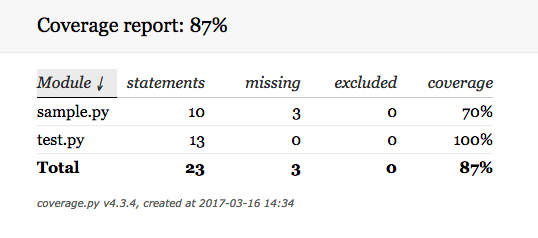
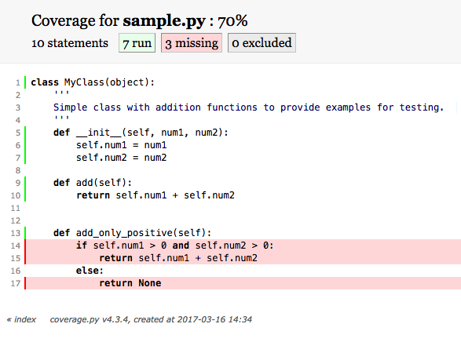

# Testing
<hr>

The purpose of this repository is to hold a simple example of how to use [pytest](http://doc.pytest.org/en/latest/) or [nose](http://nose.readthedocs.io/en/latest/index.html) in coordination with [coverage](https://coverage.readthedocs.io/en/coverage-4.3.4/index.html).

## Background

There is are two scripts in this repo `sample.py` and `test.py`. Each contains a simple class implementation. The class in `sample.py` implements two functions `add` and `add_only_positive`, and the class in `test.py` implements functions for testing these functions.

When testing we would like to know not only that our code is operating as expected, but that we are also testing all of our code. As modules become increasingly complex this is no trivial task. This is where [coverage](https://coverage.readthedocs.io/en/coverage-4.3.4/index.html) comes in.

>Coverage.py is a tool for measuring code coverage of Python programs. It monitors your program, noting which parts of the code have been executed, then analyzes the source to identify code that could have been executed but was not.

>Coverage measurement is typically used to gauge the effectiveness of tests. It can show which parts of your code are being exercised by tests, and which are not.

Using [coverage](https://coverage.readthedocs.io/en/coverage-4.3.4/index.html) along with [pytest](http://doc.pytest.org/en/latest/) or [nose](http://nose.readthedocs.io/en/latest/index.html) we can quickly test all of our code and get automatically generated reports detailing how well we are actually testing.

## Simple Example

Once coverage and the testing suite of your choice is installed you can execute the two together simply. The following code tests the `sample.py` file using `test.py` and produces a report (data stored in .coverage)

`coverage run -m nose test.py`

> N.B. You can replace `nose` with the test suite of your choice.

Subsequently running `coverage report -m` will display the details of your testing coverage on the command line. (The -m option displays the lines where your tests are missing coverage.) There is another option to create a html report which is really useful for visualizing where you tests are missing. This command will take existing coverage data to create the report.

`coverage html`

## Reports

The basic command line report looks like this.
```
Name        Stmts   Miss  Cover   Missing

-----------------------------------------
sample.py      10      0   100%
test.py        20      0   100%
-----------------------------------------
TOTAL          30      0   100%
```

I prefer the html version as you get an interactive table as well as a visual guide to your current code coverage.


Figure 1. Interactive Html table of coverage.


Figure 2. Coverage for testing only `MyClass.add` method.
